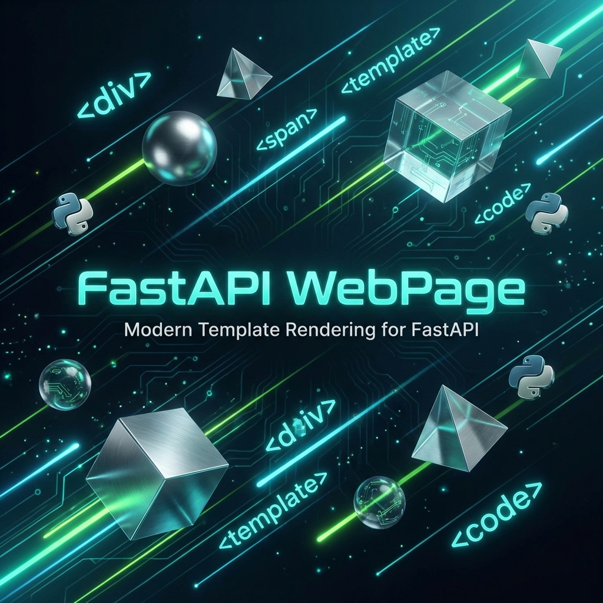

<div align="center">
  

  <h1 style="margin-top: 20px;">FastAPI WebPage</h1>

  <h2>為 FastAPI 打造的現代化網頁渲染套件</h2>

  <div align="center">
    <a href="https://github.com/user/fastapi-webpage/releases"></a>
    <a href="https://github.com/user/fastapi-webpage/blob/main/LICENSE"></a>
    <a href="https://www.python.org/"></a>
    
  </div>

  <p style="margin-top: 20px;">
    <a href="#why-fastapi-webpage">為什麼選擇本專案？</a>
    ◆ <a href="#quick-start">快速開始</a>
    ◆ <a href="#installation">安裝指南</a>
    ◆ <a href="#advanced-features">進階功能</a>
    ◆ <a href="#contributing">貢獻</a>
  </p>
</div>

---

## *最新消息* 🔥

- **[2026/01]** 🎉 **FastAPI WebPage 初始發布**！帶來 Decorator 風格的頁面渲染體驗。
- **[2026/01]** 🚀 **支援 Reverse Proxy**：內建 `urlx_for` 自動處理 `X-Forwarded-Proto`，部署更輕鬆。
- **[2026/01]** ✨ **混合錯誤處理**：智慧判斷 API 與瀏覽器請求，回傳最適當的錯誤格式。

## 為什麼選擇 FastAPI WebPage？ 🌟

FastAPI 雖然強大，但在處理傳統網頁渲染 (Server-Side Rendering) 時，Jinja2 的整合往往需要許多 boilerplate code。**FastAPI WebPage** 旨在解決這個痛點，讓你的程式碼更簡潔、更優雅。

- **🎨 Decorator 風格 API** - 告別繁瑣的 `return templates.TemplateResponse(...)`，專注於回傳資料 Context。
- **🌐 全域 Context 管理** - 輕鬆管理 `site_name`、`user` 等全域變數，不再需要在每個 Route 重複傳遞。
- **🔒 智慧 URL 修正** - 自動偵測並修正 Reverse Proxy 後的 URL Scheme，避免 HTTPS 變成 HTTP 的問題。
- **⚡ 混合模式 (Hybrid Mode)** - 同一個 App 完美支援 API (JSON) 與 WebPage (HTML)，自動處理錯誤回應格式。

## 快速開始 🚀

### 1. 建立 FastAPI App

只需幾行程式碼，即可啟用 WebPage 功能。

```python
from fastapi import FastAPI, Request
from fastapi_webpage import WebPage, register_error_handlers
from pathlib import Path

app = FastAPI()

# ✨ 初始化 WebPage
# global_context 變數可在所有 Template 中直接使用
webpage = WebPage(
    template_directory=Path("templates"),
    site_name="My Awesome Site"
)

# 🛡️ 註冊智慧錯誤處理 (選用)
register_error_handlers(app, webpage)
```

### 2. 撰寫頁面 Route

使用 `@webpage.page` 裝飾器，讓你的 Handler 只需專注於資料邏輯。

```python
@app.get("/")
@webpage.page("index.html")  # 👈 指定 Template
async def home(request: Request):
    # 只需回傳 dict，自動注入 Template Context
    return {
        "title": "首頁",
        "message": "Hello, FastAPI WebPage!"
    }
```

> **對應的 `templates/index.html`**：
> ```html
> <h1>{{ message }}</h1>
> <p>歡迎來到 {{ webpage.site_name }}</p>
> ```

## 安裝指南 📦

本專案目前尚未發布至 PyPI，請直接透過 GitHub 安裝最新版本。

### 使用 uv (推薦 ⚡)

```bash
uv add git+https://github.com/user/fastapi-webpage.git
```

### 使用 pip

```bash
pip install git+https://github.com/user/fastapi-webpage.git
```

## 進階功能 🛠️

### 1. 動態 Context 更新

你可以在 Middleware 或 Dependency 中動態注入變數到 `pre_context`，這些變數會自動合併到所有頁面的 Context 中。

```python
@app.middleware("http")
async def add_user_middleware(request: Request, call_next):
    # 例如：從 Session 讀取使用者資訊
    webpage.pre_context_update({"current_user_name": "Phoenix"})
    response = await call_next(request)
    return response
```

### 2. Reverse Proxy 支援 (`urlx_for`)

當你的服務部署在 Cloudflare 或 Nginx 後方時，標準的 `url_for` 有時會產生錯誤的 `http://` 連結。FastAPI WebPage 內建了強化的 `url_for` (在 Template 中直接使用即可)，它會檢查 `X-Forwarded-Proto` Header 並自動修正。

```html
<!-- 自動產生正確的 https:// 連結 -->
<a href="{{ url_for('home') }}">回首頁</a>
```

### 3. 智慧錯誤處理

`register_error_handlers` 會接管 FastAPI 的例外處理：

| Client 類型 | Accept Header | 回應格式 |
|------------|---------------|---------|
| **瀏覽器** | `text/html` | **HTML 錯誤頁面** (使用 `error.jinja2`) |
| **API Client** | `application/json` | **JSON** (例如 `{"detail": "Not Found"}`) |

這讓你可以用同一個 FastAPI App 同時服務 API 與網頁使用者，無需擔心錯誤處理衝突。

## 貢獻 🤝

我們歡迎所有形式的貢獻！

1. Fork 本專案
2. 建立 Feature Branch (`git checkout -b feature/AmazingFeature`)
3. 提交變更 (`git commit -m 'Add some AmazingFeature'`)
4. 推送至 Branch (`git push origin feature/AmazingFeature`)
5. 開啟 Pull Request

## 授權 📄

本專案採用 **Educational Community License v2.0 (ECL 2.0)** 授權 - 詳情請參閱 [LICENSE](LICENSE) 檔案。

<div align="center">
  
</div>

---

<div align="center">
  <p>
    <strong>用 ❤️ 打造，讓 FastAPI 開發更美好</strong><br>
    <sub>FastAPI WebPage Team</sub>
  </p>
</div>
